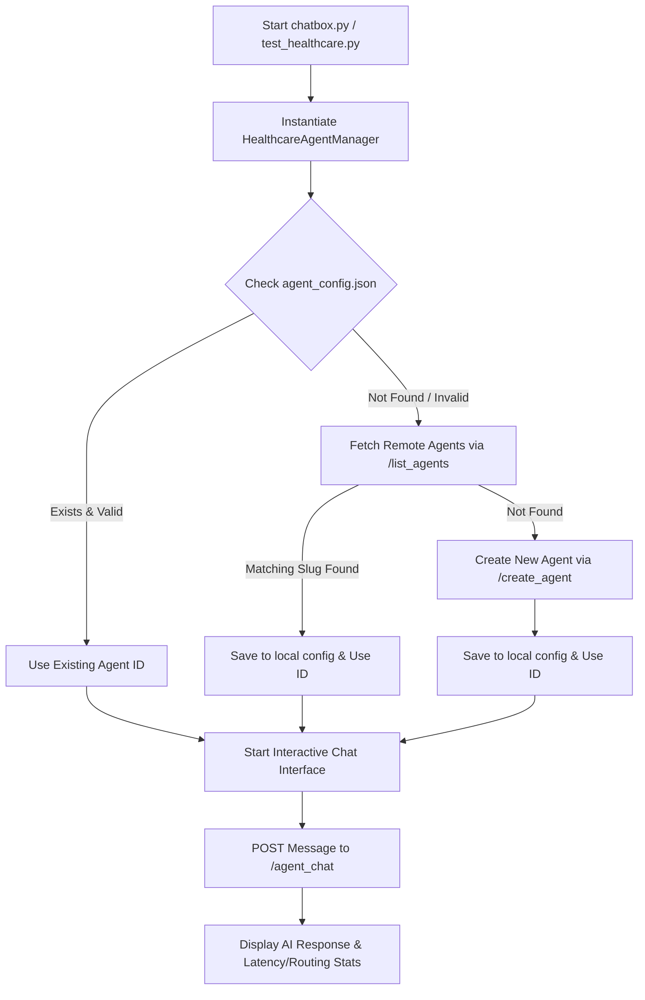

# Healthcare AI Startup Stack Integration

This directory implements a production-ready personal health coaching assistant stack, integrated with **The Manhattan Project AI Agent Platform**.

It implements a fully-automated agent onboarding system, a premium conversational CLI chatbox, and comprehensive integration test coverage.

---

## 📂 Directory Structure

*   [agent_manager.py](file:///Users/gargdhruv/Desktop/agent-architects-studio/healthcare/agent_manager.py) — The core service layer managing remote agent registration, API communication, and dynamic routing strategies.
*   [chatbox.py](file:///Users/gargdhruv/Desktop/agent-architects-studio/healthcare/chatbox.py) — Interactive premium CLI chatbox for the end-user.
*   [test_healthcare.py](file:///Users/gargdhruv/Desktop/agent-architects-studio/healthcare/test_healthcare.py) — Programmatic multi-turn integration tests verifying conversational flow, latency, and long-term context recall.
*   `agent_config.json` *(Auto-generated)* — Local config tracking registered agent metadata to ensure singleton instantiation.

---

## 🛠️ Architecture & Flow

The application follows a lightweight, robust architecture:



### Key Features
1. **Singleton Agent Enforcement:** Prevents duplicate agent creation. If an agent has already been created for the user, it is discovered either via local cache or by searching matching slugs remotely.
2. **Dynamic Auto-Routing:** Connects straight to the Manhattan platform's auto-routing engine, utilizing `fast` strategy for greetings/declarative entries and automatically scaling up to `thinking` strategy for multi-step medical/dietary synthesis.
3. **Medical Guardrails:** The system prompt strictly enforces proper safety boundaries. The AI is trained to act as a coach, not a physician, urging users to consult clinical experts during severe cases.

---

## 🚀 Quickstart Guide

### Run the Interactive Chatbox
To start the interactive terminal chatbox with premium visual aesthetics, run:
```bash
python3 chatbox.py
```

### Run the Integration Tests
To run the automated end-to-end conversational integration suite, run:
```bash
python3 test_healthcare.py
```
