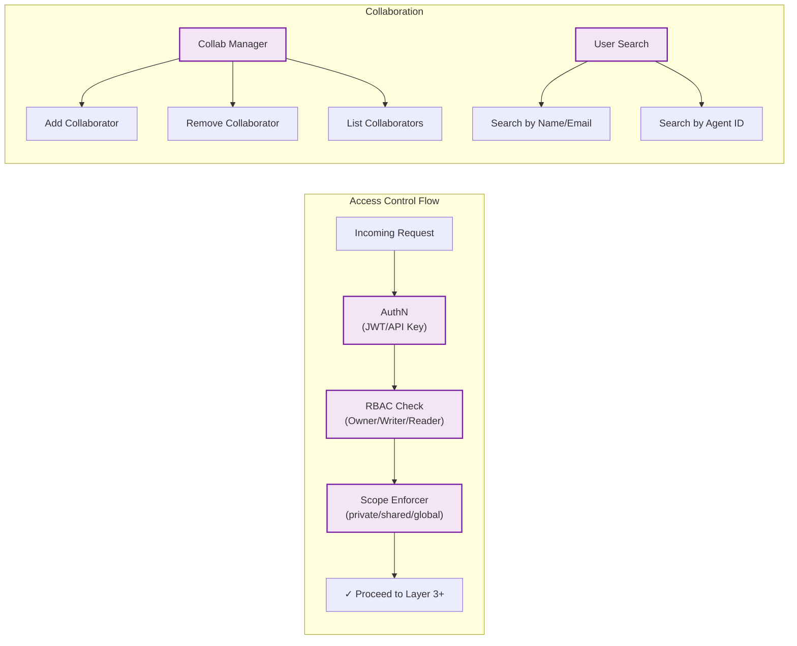
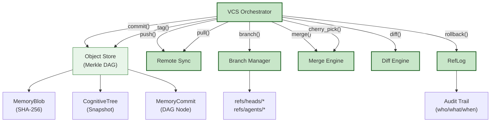
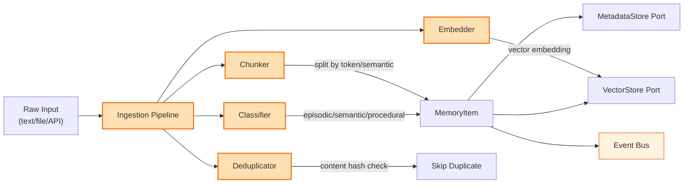
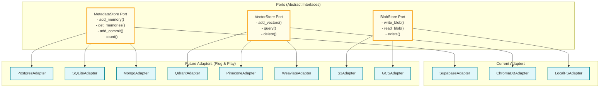

# GitMem v2.0 — Next-Generation Architecture Design

## Goal
Redesign GitMem into a **6-layer, portable, database-agnostic** architecture with GitHub-style collaboration, full version control (push/pull/cherry-pick), access management, and swappable storage backends.

---

## Architecture Overview (Block Diagram)

```mermaid
graph TD
    classDef L1 fill:#e3f2fd,stroke:#1565c0,stroke-width:2px,color:#0d47a1
    classDef L2 fill:#f3e5f5,stroke:#7b1fa2,stroke-width:2px,color:#4a148c
    classDef L3 fill:#e8f5e9,stroke:#2e7d32,stroke-width:2px,color:#1b5e20
    classDef L4 fill:#fff3e0,stroke:#e65100,stroke-width:2px,color:#bf360c
    classDef L5 fill:#fce4ec,stroke:#c2185b,stroke-width:2px,color:#880e4f
    classDef L6 fill:#e0f7fa,stroke:#00838f,stroke-width:2px,color:#006064
    classDef port fill:#fffde7,stroke:#f9a825,stroke-width:3px,color:#f57f17

    subgraph "LAYER 1 — Interface & Prompt Layer"
        UI["Web UI Dashboard\n(templates/, static/)"]:::L1
        SDK["Agent SDK Client\n(sdk/client.py)"]:::L1
        CLI["CLI Tool\n(sdk/cli.py) [NEW]"]:::L1
        RESTAPI["REST API Gateway\n(api/routes.py)"]:::L1
        WS["WebSocket Events\n(api/websocket_events.py)"]:::L1
    end

    subgraph "LAYER 2 — Access & Collaboration Layer"
        AuthN["AuthN Service\n(core/auth.py) [NEW]"]:::L2
        RBAC["RBAC Engine\n(core/rbac.py) [NEW]"]:::L2
        CollabMgr["Collaboration Manager\n(core/collab_manager.py) [NEW]"]:::L2
        UserSearch["User/Agent Search\n(core/user_search.py) [NEW]"]:::L2
        ScopeEnf["Scope Enforcer\n(core/scope.py) [NEW]"]:::L2
    end

    subgraph "LAYER 3 — Version Control Layer"
        VCS["VCS Orchestrator\n(core/vcs_orchestrator.py) [NEW]"]:::L3
        ObjStore["Object Store (Merkle DAG)\n(core/object_store.py)"]:::L3
        BranchMgr["Branch Manager\n(core/branch_manager.py) [NEW]"]:::L3
        MergeEng["Merge & Cherry-Pick Engine\n(core/merge_engine.py) [NEW]"]:::L3
        DiffEng["Diff Engine\n(core/diff_engine.py) [NEW]"]:::L3
        RefLog["RefLog & Audit Trail\n(core/reflog.py) [NEW]"]:::L3
    end

    subgraph "LAYER 4 — Data Ingestion Layer"
        Ingestor["Ingestion Pipeline\n(core/ingestion.py) [NEW]"]:::L4
        Chunker["Chunker & Splitter\n(core/chunker.py) [NEW]"]:::L4
        Embedder["Embedding Service\n(core/embedder.py) [NEW]"]:::L4
        Classifier["Memory Classifier\n(core/classifier.py) [NEW]"]:::L4
        EventBus["Event Bus\n(core/event_bus.py)"]:::L4
    end

    subgraph "LAYER 5 — Context Building Layer"
        CtxSvc["Context Assembler\n(core/context_service.py)"]:::L5
        Ranker["Relevance Ranker\n(core/ranker.py) [NEW]"]:::L5
        TokenPack["Token Packer\n(core/token_packer.py) [NEW]"]:::L5
        Summarizer["AI Summarizer\n(core/summarizer.py) [NEW]"]:::L5
        AgentMgr["Agent Manager\n(core/agent_manager.py)"]:::L5
    end

    subgraph "LAYER 6 — Storage Abstraction Layer"
        direction LR
        MetaPort["MetadataStore Port\n(ports/metadata_port.py) [NEW]"]:::port
        VectorPort["VectorStore Port\n(ports/vector_port.py) [NEW]"]:::port
        BlobPort["BlobStore Port\n(ports/blob_port.py) [NEW]"]:::port
    end

    subgraph "Storage Adapters (Swappable)"
        SupaAdapt["Supabase Adapter\n(adapters/supabase_adapter.py)"]:::L6
        PGAdapt["Postgres Adapter\n(adapters/postgres_adapter.py) [NEW]"]:::L6
        SQLiteAdapt["SQLite Adapter\n(adapters/sqlite_adapter.py) [NEW]"]:::L6
        ChromaAdapt["ChromaDB Adapter\n(adapters/chroma_adapter.py)"]:::L6
        QdrantAdapt["Qdrant Adapter\n(adapters/qdrant_adapter.py) [NEW]"]:::L6
        S3Adapt["S3/Local FS Adapter\n(adapters/blob_fs_adapter.py) [NEW]"]:::L6
    end

    %% Layer Connections
    UI --> RESTAPI
    SDK --> RESTAPI
    CLI --> RESTAPI
    RESTAPI --> AuthN
    WS --> AuthN

    AuthN --> RBAC
    RBAC --> ScopeEnf
    RBAC --> CollabMgr
    CollabMgr --> UserSearch

    RESTAPI --> VCS
    ScopeEnf --> VCS
    VCS --> ObjStore
    VCS --> BranchMgr
    VCS --> MergeEng
    VCS --> DiffEng
    VCS --> RefLog

    RESTAPI --> Ingestor
    Ingestor --> Chunker
    Ingestor --> Embedder
    Ingestor --> Classifier
    Ingestor --> EventBus

    RESTAPI --> CtxSvc
    CtxSvc --> Ranker
    CtxSvc --> TokenPack
    CtxSvc --> Summarizer
    CtxSvc --> AgentMgr

    ObjStore --> BlobPort
    Ingestor --> MetaPort
    Ingestor --> VectorPort
    CtxSvc --> VectorPort
    VCS --> MetaPort

    MetaPort --> SupaAdapt
    MetaPort --> PGAdapt
    MetaPort --> SQLiteAdapt
    VectorPort --> ChromaAdapt
    VectorPort --> QdrantAdapt
    BlobPort --> S3Adapt
```



---

## Layer-by-Layer Detailed Design

---

### LAYER 1 — Interface & Prompt Layer
> *"Where users and agents interact with GitMem"*

| Component | File | Status | Purpose |
|---|---|---|---|
| Web UI | `templates/`, `static/` | EXISTS | Dashboard, agent views, file browser |
| REST API | `api/routes.py` | EXISTS | HTTP gateway for all operations |
| WebSocket | `api/websocket_events.py` | EXISTS | Real-time event streaming |
| Agent SDK | `sdk/client.py` | EXISTS | Python client for agents |
| CLI Tool | `sdk/cli.py` | **NEW** | `gitmem commit`, `gitmem push`, `gitmem log` |

**Key Design**: All inputs (user prompts, SDK calls, CLI commands) normalize into a unified **Request** object that flows through the stack. The REST API acts as the single entry funnel.

---

### LAYER 2 — Access & Collaboration Layer
> *"GitHub-style sharing, collaborators, and permissions"*



| Component | File | Purpose |
|---|---|---|
| **AuthN Service** | `core/auth.py` [NEW] | JWT validation, API key management |
| **RBAC Engine** | `core/rbac.py` [NEW] | Role-based access: `Owner`, `Admin`, `Writer`, `Reader` |
| **Collaboration Manager** | `core/collab_manager.py` [NEW] | Add/remove collaborators per repository |
| **User Search** | `core/user_search.py` [NEW] | Search users by name/email/agent, invite collaborators |
| **Scope Enforcer** | `core/scope.py` [NEW] | Enforces `private`/`shared`/`global` memory visibility |

**Key Data Model** — `Collaborator`:
```python
class Collaborator(BaseModel):
    user_id: str
    repo_id: str        # agent_id or repo name
    role: Literal["owner", "admin", "writer", "reader"]
    invited_by: str
    accepted: bool = False
    created_at: datetime
```

**Key Data Model** — `AccessPolicy`:
```python
class AccessPolicy(BaseModel):
    repo_id: str
    visibility: Literal["private", "shared", "public"]
    allowed_users: List[str]       # explicit user_ids
    allowed_teams: List[str]       # team/org names
    default_branch_protection: bool = False
```

---

### LAYER 3 — Version Control Layer
> *"Full Git-like semantics: commit, push, pull, rollback, cherry-pick, merge"*



| Component | File | Status | Operations |
|---|---|---|---|
| **VCS Orchestrator** | `core/vcs_orchestrator.py` | **NEW** | Central facade for all VCS ops |
| **Object Store** | `core/object_store.py` | EXISTS | Blob/Tree/Commit storage (Merkle DAG) |
| **Branch Manager** | `core/branch_manager.py` | **NEW** | Create/delete/list/protect branches |
| **Merge Engine** | `core/merge_engine.py` | **NEW** | 3-way merge, cherry-pick, conflict resolution |
| **Diff Engine** | `core/diff_engine.py` | **NEW** | Structural diff between cognitive states |
| **RefLog** | `core/reflog.py` | **NEW** | Immutable audit log of all ref changes |

**Supported Operations**:
- `commit(message)` — Snapshot current cognitive state
- `push(remote)` — Sync local commits to remote (Supabase)
- `pull(remote)` — Fetch and merge remote changes
- `rollback(sha)` — Hard reset HEAD to target
- `cherry_pick(sha)` — Apply a single commit's changes to current branch
- `branch(name)` / `checkout(name)` — Branching & switching
- `merge(source, target)` — 3-way merge with conflict detection
- `tag(name, sha)` — Named snapshots (releases)
- `diff(sha_a, sha_b)` — Compare two cognitive states
- `log(limit)` — Walk the DAG history

---

### LAYER 4 — Data Ingestion Layer
> *"Processing raw data into structured, embedded, classified memories"*



| Component | File | Status | Purpose |
|---|---|---|---|
| **Ingestion Pipeline** | `core/ingestion.py` | **NEW** | Orchestrates the full ingest flow |
| **Chunker** | `core/chunker.py` | **NEW** | Token-aware and semantic splitting |
| **Embedder** | `core/embedder.py` | **NEW** | Pluggable embedding (OpenAI, local, etc.) |
| **Classifier** | `core/classifier.py` | **NEW** | Auto-classify memory type + importance |
| **Event Bus** | `core/event_bus.py` | EXISTS | Publish events for real-time UI |

---

### LAYER 5 — Context Building & Algorithms Layer
> *"Intelligent retrieval, ranking, and packing for LLM prompts"*

| Component | File | Status | Purpose |
|---|---|---|---|
| **Context Assembler** | `core/context_service.py` | EXISTS (refactor) | Multi-source aggregation |
| **Relevance Ranker** | `core/ranker.py` | **NEW** | MMR, recency decay, importance weighting |
| **Token Packer** | `core/token_packer.py` | **NEW** | Bin-packing within token budgets |
| **AI Summarizer** | `core/summarizer.py` | **NEW** | Compress old memories via LLM |
| **Agent Manager** | `core/agent_manager.py` | EXISTS | Agent lifecycle & heartbeats |

**Ranking Algorithm** — Multi-signal scoring:
```
score = (w1 × semantic_similarity) + (w2 × recency_decay) + (w3 × importance) + (w4 × access_frequency)
```

---

### LAYER 6 — Storage Abstraction Layer (Ports & Adapters)
> *"Portable, swappable, future-proof database layer"*

This is the **critical portability layer**. We use the **Ports & Adapters** (Hexagonal Architecture) pattern so that all business logic depends on **abstract interfaces (Ports)**, never on concrete databases.



**Port Interface Example** — `MetadataStorePort`:
```python
# ports/metadata_port.py
from abc import ABC, abstractmethod

class MetadataStorePort(ABC):
    @abstractmethod
    def add_memory(self, data: dict) -> None: ...
    
    @abstractmethod
    def get_memories(self, agent_id: str, mtype: str, limit: int) -> list: ...
    
    @abstractmethod
    def add_commit(self, data: dict) -> None: ...
    
    @abstractmethod
    def get_commits(self, limit: int) -> list: ...
    
    @abstractmethod
    def count_memories(self, agent_id: str, mtype: str) -> int: ...
    
    @abstractmethod
    def health_check(self) -> bool: ...
```

**Adapter Example** — `SupabaseAdapter` (implements the port):
```python
# adapters/supabase_adapter.py
class SupabaseAdapter(MetadataStorePort):
    def __init__(self, url: str, key: str):
        self.client = create_client(url, key)
    
    def add_memory(self, data: dict) -> None:
        self.client.table("gitmem_memories").insert(data).execute()
    
    # ... implements all abstract methods
```

**Switching databases** becomes a **one-line config change**:
```yaml
# config.yaml
storage:
  metadata:
    adapter: "supabase"       # Change to "postgres" or "sqlite"
    connection_string: "..."
  vector:
    adapter: "chromadb"       # Change to "qdrant" or "pinecone"
    connection_string: "..."
  blob:
    adapter: "local_fs"       # Change to "s3" or "gcs"
    path: "./.gitmem/objects"
```

---

## Mapping Current Code → New Architecture

| Current File | New Location | Changes |
|---|---|---|
| `core/memory_store.py` | Split → `core/vcs_orchestrator.py` + ports | Extract VCS logic, use ports for storage |
| `core/supabase_connector.py` | → `adapters/supabase_adapter.py` | Implement `MetadataStorePort` interface |
| `core/vector_engine.py` | → `adapters/chroma_adapter.py` | Implement `VectorStorePort` interface |
| `core/object_store.py` | Stays (Layer 3) | Add push/pull/cherry-pick methods |
| `core/context_service.py` | Stays (Layer 5) | Refactor to use ports instead of direct DB |
| `core/event_bus.py` | Stays (Layer 4) | No changes |
| `core/agent_manager.py` | Stays (Layer 5) | No changes |
| `core/models.py` | Stays + expand | Add `Collaborator`, `AccessPolicy`, `RefLogEntry` |
| `api/routes.py` | Stays (Layer 1) | Add collab/VCS endpoints |
| `sdk/client.py` | Stays (Layer 1) | Add push/pull/cherry-pick methods |

---

## New Directory Structure

```
gitmem/
├── api/                          # LAYER 1 — Interface
│   ├── routes.py                 # REST API (existing, extended)
│   └── websocket_events.py       # WebSocket (existing)
│
├── sdk/                          # LAYER 1 — Interface
│   ├── client.py                 # Python SDK (existing, extended)
│   ├── cli.py                    # [NEW] CLI tool
│   └── models.py                 # SDK models (existing)
│
├── core/                         # LAYERS 2-5 — Business Logic
│   ├── models.py                 # Data models (existing, extended)
│   ├── auth.py                   # [NEW] L2: Authentication
│   ├── rbac.py                   # [NEW] L2: Role-based access
│   ├── collab_manager.py         # [NEW] L2: Collaborators
│   ├── user_search.py            # [NEW] L2: User/agent search
│   ├── scope.py                  # [NEW] L2: Scope enforcement
│   ├── vcs_orchestrator.py       # [NEW] L3: VCS facade
│   ├── object_store.py           # L3: Merkle DAG (existing)
│   ├── branch_manager.py         # [NEW] L3: Branch ops
│   ├── merge_engine.py           # [NEW] L3: Merge/cherry-pick
│   ├── diff_engine.py            # [NEW] L3: Diff engine
│   ├── reflog.py                 # [NEW] L3: Audit trail
│   ├── ingestion.py              # [NEW] L4: Pipeline orchestrator
│   ├── chunker.py                # [NEW] L4: Text splitting
│   ├── embedder.py               # [NEW] L4: Embedding service
│   ├── classifier.py             # [NEW] L4: Memory classifier
│   ├── event_bus.py              # L4: Events (existing)
│   ├── context_service.py        # L5: Context assembly (existing)
│   ├── ranker.py                 # [NEW] L5: Relevance ranking
│   ├── token_packer.py           # [NEW] L5: Token budgets
│   ├── summarizer.py             # [NEW] L5: AI summarization
│   └── agent_manager.py          # L5: Agent lifecycle (existing)
│
├── ports/                        # LAYER 6 — Abstract Interfaces
│   ├── __init__.py
│   ├── metadata_port.py          # [NEW] ABC for metadata DBs
│   ├── vector_port.py            # [NEW] ABC for vector DBs
│   └── blob_port.py              # [NEW] ABC for blob storage
│
├── adapters/                     # LAYER 6 — Concrete Implementations
│   ├── __init__.py
│   ├── supabase_adapter.py       # [NEW] (from supabase_connector.py)
│   ├── sqlite_adapter.py         # [NEW] Local dev fallback
│   ├── chroma_adapter.py         # [NEW] (from vector_engine.py)
│   ├── qdrant_adapter.py         # [NEW] Future vector DB
│   └── blob_fs_adapter.py        # [NEW] Local filesystem blobs
│
└── config.yaml                   # Storage backend config (existing)
```

---

## Open Questions

> [!IMPORTANT]
> **Q1**: Should we implement the collaboration system using Supabase RLS (Row-Level Security) for automatic access control, or handle it purely in application code? RLS is more secure but couples us to Postgres.

> [!IMPORTANT]
> **Q2**: For `push`/`pull` — should the "remote" always be Supabase, or do you want to support arbitrary remotes (like a second GitMem instance)?

> [!WARNING]
> **Q3**: The current `memory_store.py` mixes VCS logic with storage logic. The refactor will require careful migration to avoid breaking the existing UI routes. Should we do this incrementally (adapter pattern around existing code) or as a clean rewrite?

---

## Verification Plan

### Automated Tests
- Unit tests for each Port interface with mock adapters
- Integration tests swapping SQLite ↔ Supabase adapters
- VCS operation tests: commit → branch → cherry-pick → merge → rollback

### Manual Verification
- Run existing UI after refactor to confirm no regressions
- Test collaborator invite flow end-to-end
- Demonstrate database swap via config change only
